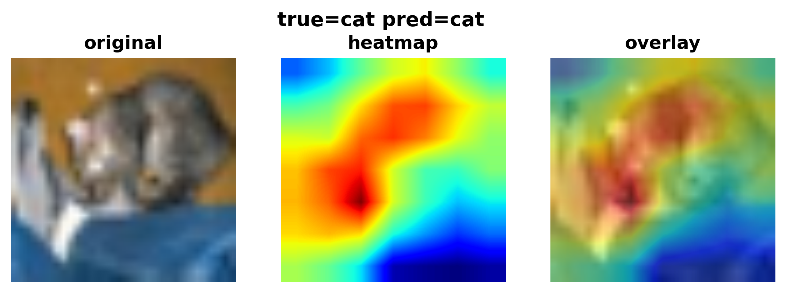
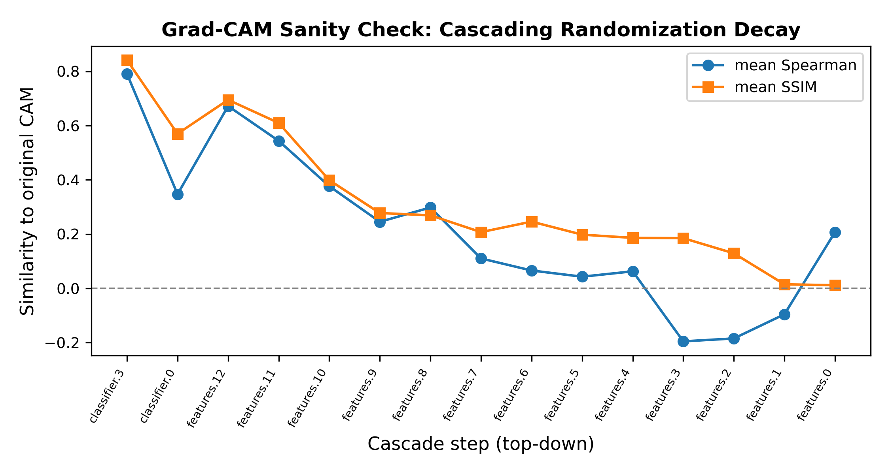
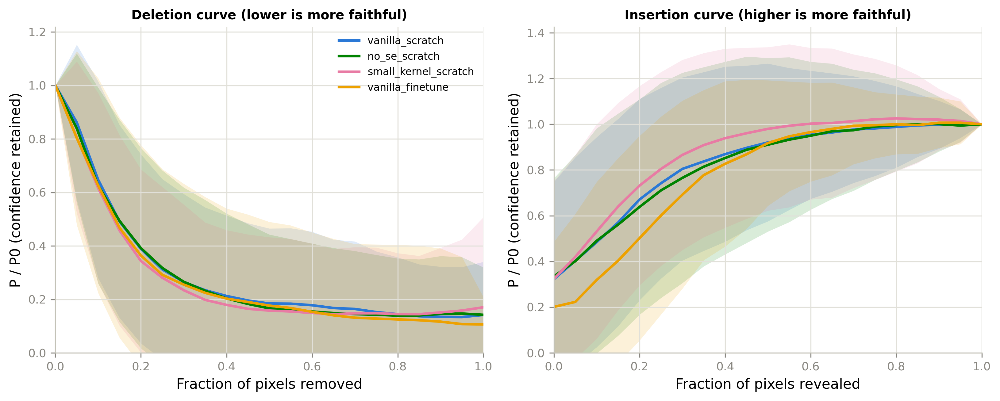
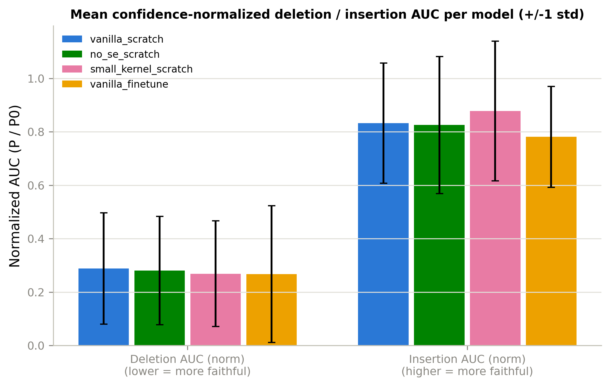
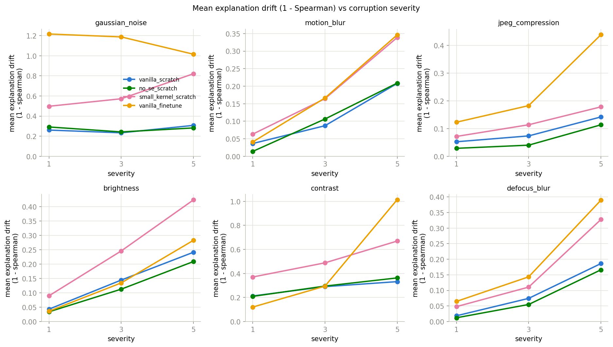
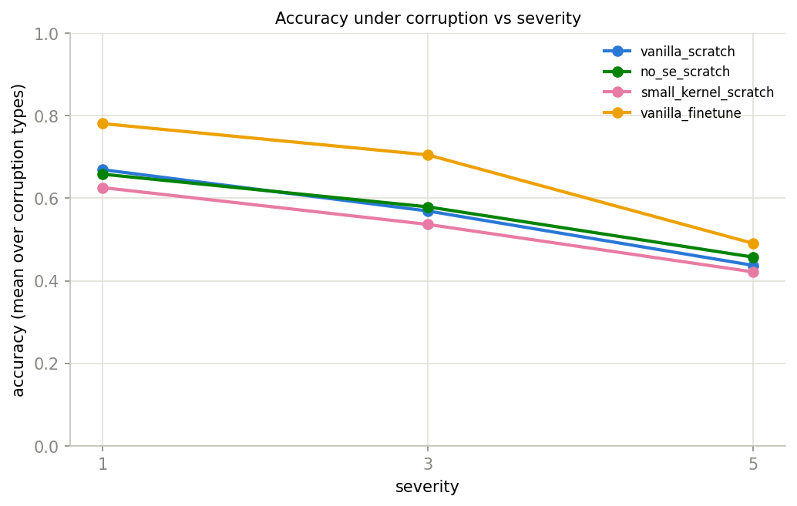
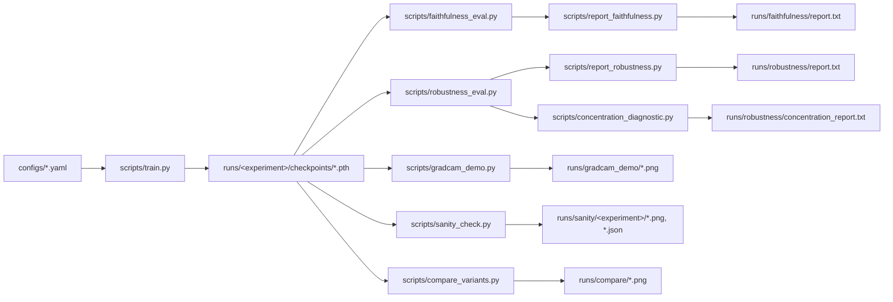

# Interpreting MobileNetV3-Small on CIFAR-10

**Do architectural choices change how much you can trust a saliency map?**

A from-scratch interpretability study of three MobileNetV3-Small variants —
`vanilla` (standard architecture), `no_se` (squeeze-and-excitation blocks
removed), and `small_kernel` (5x5 depthwise convolutions replaced with 3x3) —
trained on CIFAR-10. Explanations are produced with a from-scratch Grad-CAM
implementation and evaluated along three independent axes: sanity
(parameter-randomization), faithfulness (deletion/insertion/ROAD), and
robustness to distribution shift (explanation drift under corruption). This
is the codebase behind an in-progress research paper on how architectural
choices affect the reliability of saliency-based explanations.

## Research motivation

Grad-CAM and similar saliency methods are widely used to explain CNN
predictions, but two failure modes are well documented in the literature:
explanations can be insensitive to the model's learned weights (Adebayo et
al., 2018), and they are not guaranteed to reflect what the model actually
relies on to make a prediction (i.e., they can fail faithfulness checks).
This project asks a narrower, less-studied question: **holding the task and
training procedure fixed, does changing the architecture change the
reliability of its explanations?** Three matched MobileNetV3-Small variants
are compared so that any measured difference is attributable to one
architectural change (removing SE blocks, or shrinking the depthwise kernel)
rather than to training procedure, dataset, or capacity differences.

## Features

- **From-scratch Grad-CAM** (Selvaraju et al., 2017) — hook-based
  implementation with overlay visualization, independent of any third-party
  CAM library.
- **Sanity checks** — the cascading (top-down) parameter-randomization test
  (Adebayo et al., 2018), quantified with Spearman and SSIM similarity to
  the original CAM, to confirm explanations are weight-dependent rather than
  degenerate edge detectors.
- **Quantitative faithfulness** — deletion/insertion AUC and ROAD
  (Remove-and-Debias, Rong et al., 2022) gap, with confidence-normalization
  (dividing by the model's own initial confidence) so faithfulness is
  comparable across models with different calibration, plus paired
  significance testing (t-test, Wilcoxon, Cohen's d, Bonferroni correction)
  and TOST equivalence testing.
- **Cross-variant Grad-CAM comparison** — the same test images run through
  multiple checkpoints, rendered side by side.
- **Distribution-shift robustness** — Grad-CAM drift under six
  ImageNet-C-style corruptions at three severities, measured against a
  *fixed* target class (the clean prediction) so drift isn't conflated with
  the model simply answering a different question after corruption; a
  CAM-concentration diagnostic and per-corruption breakdown rule out
  confounds and localize the effect.
- **Fully reproducible** — every experiment is defined by a YAML config with
  a fixed seed; every metric has a corresponding smoke test that runs
  without downloading CIFAR-10.

## Results so far

- `vanilla_scratch` reaches **~80.5% test accuracy** on CIFAR-10 after 10
  epochs of from-scratch training.
- Grad-CAM passes the cascading parameter-randomization sanity check:
  similarity to the original CAM decays from ~0.8 toward ~0 as the model is
  progressively randomized top-down, confirming the explanations are
  weight-dependent rather than degenerate edge maps.
- Faithfulness (deletion/insertion AUC, ROAD gap), once confidence-normalized,
  is statistically **equivalent** (TOST) between most model pairs — the SE
  and kernel-size ablations mostly don't change *static* faithfulness, with
  a small number of metric/pair exceptions detailed in
  `runs/faithfulness/report.txt`.
- Under distribution shift, explanation **drift scales with architecture,
  not just with accuracy loss**: `vanilla_finetune` and `small_kernel_scratch`
  show drift well beyond what their accuracy drop alone predicts
  (drift/acc-drop ratio 1.4 and 1.3, vs. 0.6 for
  `vanilla_scratch`/`no_se_scratch`), an effect that is not explained by
  CAM-sharpness confounds and is concentrated in additive/sensor noise
  (`gaussian_noise`) rather than brightness/contrast.

See [`CHANGELOG.md`](CHANGELOG.md) for the full phase-by-phase development
history.

### Headline results table

| Model | Test accuracy | Norm. deletion AUC ↓ | Norm. insertion AUC ↑ | Norm. ROAD gap ↑ | Mean drift (1 − Spearman) | Drift / acc-drop ratio |
|---|---|---|---|---|---|---|
| `vanilla_scratch` | 80.55% | 0.288 | 0.833 | 0.454 | 0.164 | 0.61 |
| `no_se_scratch` | 81.29% | 0.281 | 0.825 | 0.504 | 0.155 | 0.59 |
| `small_kernel_scratch` | 76.34% | 0.269 | 0.878 | 0.540 | 0.311 | 1.26 |
| `vanilla_finetune` | 95.59% | 0.268 | 0.781 | 0.551 | 0.400 | 1.42 |

Lower is more faithful for deletion AUC; higher is more faithful for
insertion AUC and ROAD gap. Mean drift and the drift/acc-drop ratio are
averaged over all six corruptions and three severities (Phase 7); see
`runs/faithfulness/report.txt` and `runs/robustness/report.txt` for the full
breakdown, confidence intervals, and significance tests behind these numbers.

## Repository structure

```
configs/                   One YAML per experiment (seed, model variant, data, training hyperparameters).
src/
  data/cifar10.py             CIFAR-10 loaders, transforms, denormalization, class names.
  models/mobilenetv3_variants.py  The three MobileNetV3-Small architectures.
  train/engine.py             Train/eval loops, checkpointing, eval artifacts.
  explain/gradcam.py           From-scratch Grad-CAM + overlay visualization.
  explain/sanity.py            Cascading parameter-randomization sanity check.
  explain/compare.py           Cross-variant Grad-CAM comparison.
  metrics/faithfulness.py      Deletion/insertion AUC, ROAD gap, paired significance testing.
  metrics/equivalence.py       TOST equivalence testing (used across faithfulness/robustness reports).
  robustness/corruptions.py    ImageNet-C-style corruption functions.
  robustness/drift.py          Grad-CAM drift measurement under corruption.
  utils/                       Config loading, seeding, and shared script helpers.
scripts/
  train.py                     Train a variant from a config.
  gradcam_demo.py               Save Grad-CAM overlay panels for a checkpoint.
  sanity_check.py               Run the Grad-CAM sanity check on a checkpoint.
  compare_variants.py           Run the cross-variant Grad-CAM comparison.
  faithfulness_eval.py          Run faithfulness metrics on a set of checkpoints.
  report_faithfulness.py        Reporting layer over faithfulness runs (summaries, TOST, p0 diagnostic).
  robustness_eval.py            Run the robustness/drift evaluation across checkpoints.
  report_robustness.py          Per-corruption drift breakdown, accuracy-floor sensitivity analysis.
  concentration_diagnostic.py   CAM concentration diagnostic + drift equivalence testing.
  smoke_test*.py                Fast, no-download checks for each module.
runs/                       Experiment outputs (checkpoints, metrics, figures) — gitignored, see below.
weights/README.md          Where to get / how to regenerate trained checkpoints.
```

## Installation

Requires Python 3.10+ and PyTorch 2.2+. Developed and tested with
Python 3.13, PyTorch 2.11 (CPU build); a CUDA-enabled PyTorch build will be
used automatically if available (`--device auto`, the default).

```powershell
git clone <this-repo>
cd RESEARCH_PAPER
pip install -r requirements.txt
```

## Dataset preparation

No manual download is required. `scripts/train.py` and every evaluation
script download CIFAR-10 via `torchvision.datasets.CIFAR10` into `./data` on
first use (`--data-root` to override). Every script also accepts
`--no-download`, which substitutes a synthetic random dataset — useful for
smoke-testing a full pipeline without a network connection.

## Training

```powershell
python scripts/train.py --config configs/vanilla_scratch.yaml
python scripts/train.py --config configs/no_se_scratch.yaml
python scripts/train.py --config configs/small_kernel_scratch.yaml
```

Each config defines `model`, `data`, and `train` sections and is loaded with
dot-access:

```python
from src.utils import load_config

cfg = load_config("configs/vanilla_scratch.yaml")
cfg.model.variant  # "vanilla"
```

Outputs go to `runs/<experiment>/` (checkpoints, `metrics.json`, and eval
artifacts — see [`weights/README.md`](weights/README.md) for the checkpoint
layout).

## Fine-tuning

`configs/vanilla_finetune.yaml` starts from ImageNet-pretrained weights
(`model.pretrained: true`, only valid for the `vanilla` variant, since the
`no_se`/`small_kernel` ablations change the network topology and can't
reuse ImageNet weights):

```powershell
python scripts/train.py --config configs/vanilla_finetune.yaml
```

## Evaluation

Training automatically runs a final evaluation pass and writes
`runs/<experiment>/eval/{predictions,confusion_matrix,correct_indices,incorrect_indices}.json`.
These per-image records are what downstream Grad-CAM/faithfulness scripts
use to pick correctly-classified visualization images.

## Grad-CAM

```powershell
python scripts/gradcam_demo.py --checkpoint runs/vanilla_scratch/checkpoints/best.pth --num-images 8
```

Saves original/heatmap/overlay panels to `runs/gradcam_demo/`.

## Ablation study

Cross-variant Grad-CAM comparison — same test images, multiple checkpoints,
side by side:

```powershell
python scripts/compare_variants.py --checkpoints `
    runs/vanilla_scratch/checkpoints/best.pth `
    runs/no_se_scratch/checkpoints/best.pth `
    runs/small_kernel_scratch/checkpoints/best.pth --num-images 6 --only-all-correct
```

Quantitative faithfulness across the same variants:

```powershell
python scripts/faithfulness_eval.py --checkpoints `
    runs/vanilla_scratch/checkpoints/best.pth `
    runs/no_se_scratch/checkpoints/best.pth `
    runs/small_kernel_scratch/checkpoints/best.pth `
    runs/vanilla_finetune/checkpoints/best.pth --num-images 500

python scripts/report_faithfulness.py
```

## Distribution-shift experiments

```powershell
python scripts/robustness_eval.py --checkpoints `
    runs/vanilla_scratch/checkpoints/best.pth `
    runs/no_se_scratch/checkpoints/best.pth `
    runs/small_kernel_scratch/checkpoints/best.pth `
    runs/vanilla_finetune/checkpoints/best.pth --num-images 200

python scripts/report_robustness.py
python scripts/concentration_diagnostic.py --checkpoints <same checkpoints as above>
```

## Reliability verification (sanity checks)

Cascading parameter-randomization test (Adebayo et al., 2018) — confirms
Grad-CAM explanations track learned weights rather than acting as edge
detectors:

```powershell
python scripts/sanity_check.py --checkpoint runs/vanilla_scratch/checkpoints/best.pth
```

## Smoke tests

Each module has a smoke test that runs without downloading CIFAR-10:

```powershell
python scripts/smoke_test.py                 # data/config/model utilities
python scripts/smoke_test_train.py           # training + evaluation harness
python scripts/smoke_test_gradcam.py         # Grad-CAM
python scripts/smoke_test_sanity.py          # sanity-check mechanics
python scripts/smoke_test_compare.py         # cross-variant comparison
python scripts/smoke_test_faithfulness.py    # faithfulness metrics
python scripts/smoke_test_robustness.py      # corruptions + drift
```

## Example outputs

Running the commands above populates `runs/` with (a static, representative
copy of each figure below is committed under `docs/assets/` for this README;
`runs/` itself is gitignored and regenerated locally):

**Grad-CAM overlay** (`runs/gradcam_demo/gradcam_*.png`)



**Sanity check decay** (`runs/sanity/<experiment>/decay_plot.png`) — Spearman/SSIM similarity to the original CAM as the model is progressively randomized top-down:



**Faithfulness curves and AUC comparison** (`runs/faithfulness/*.png`):




**Robustness under distribution shift** (`runs/robustness/*.png`):




Cross-variant comparison grids (`runs/compare/*.png`) are omitted here for
file size; regenerate them with `scripts/compare_variants.py`.

## Experiment pipeline



## Reproducibility notes

- Every config fixes `seed: 42`; `src.utils.set_seed` seeds Python, NumPy,
  and torch (CPU + CUDA) and disables cuDNN benchmark-mode autotuning for
  deterministic kernels.
- Checkpoints record their own `val_acc` and training `config`; evaluation
  scripts cross-check a loaded checkpoint's recorded `val_acc` against its
  experiment's `metrics.json` and fail loudly on a mismatch, so a
  stale/regenerated checkpoint can never silently produce misleading
  downstream numbers.
- Developed with Python 3.13 and PyTorch 2.11 (CPU); any PyTorch 2.2+ build
  (CPU or CUDA) should reproduce the same results modulo standard
  floating-point/GPU nondeterminism.

## Citation

If you use this codebase in your research, please cite:

```bibtex
@misc{shah2026interpreting,
  title  = {Interpreting MobileNetV3-Small on CIFAR-10: Architectural
            Effects on Saliency Explanation Reliability},
  author = {Shah, Dhwanit},
  year   = {2026},
  howpublished = {\url{<repository-url>}}
}
```

## License

[MIT](LICENSE).

## Acknowledgements

- Grad-CAM: Selvaraju, R. R., et al. "Grad-CAM: Visual Explanations from
  Deep Networks via Gradient-based Localization." ICCV 2017.
- Sanity checks: Adebayo, J., et al. "Sanity Checks for Saliency Maps."
  NeurIPS 2018.
- ROAD: Rong, Y., et al. "A Consistent and Efficient Evaluation Strategy for
  Attribution Methods." ICML 2022.
- MobileNetV3: Howard, A., et al. "Searching for MobileNetV3." ICCV 2019.
  Base architecture and ImageNet-pretrained weights via `torchvision`.
- Corruption functions: the `imagecorruptions` package (Hendrycks & Dietterich,
  "Benchmarking Neural Network Robustness to Common Corruptions and
  Perturbations," ICLR 2019), with a manual NumPy/PIL fallback.
